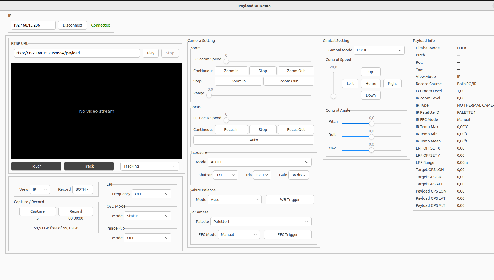
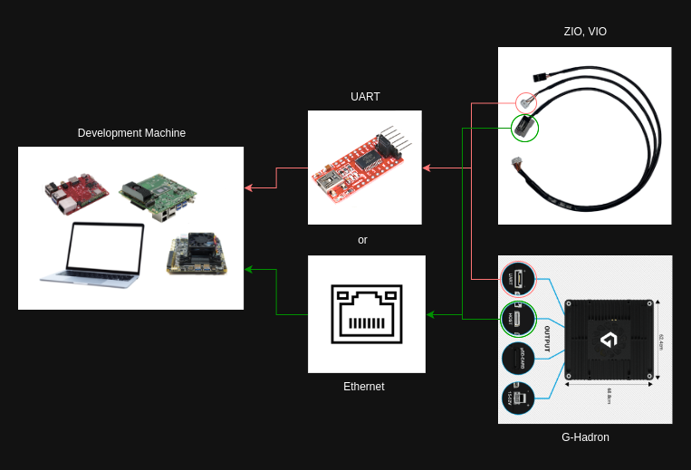

# Gremsy PayloadSDK

**Official Software Development Kit for Gremsy Payload Devices**

The Gremsy PayloadSDK provides a comprehensive C++ library for integrating and controlling Gremsy's advanced payload systems. Whether you're building custom applications, integrating with existing platforms, or testing payload capabilities, this SDK offers a complete solution with an intuitive API and ready-to-use demo applications.

---

## 🎯 Key Highlights

### 🖥️ **Professional UI Demo Application**
Experience the full power of Gremsy payloads through our feature-rich graphical interface:
- **Real-time RTSP video streaming** with interactive tracking controls
- **Complete camera control panel** - zoom, focus, exposure, white balance, IR settings
- **Intuitive gimbal control** - modes, speed adjustment, precise angle positioning
- **Live telemetry monitoring** - GPS, storage, temperature, LRF data
- **One-click operations** - capture, record, auto-focus, tracking


*Professional control interface for Gremsy payload devices*

### 🚀 **Cross-Platform Support**
- Ubuntu PC (x86_64)
- NVIDIA Jetson (aarch64)
- Raspberry Pi
- Qualcomm RB5165

### 🔧 **Compatible Payloads**
- **VIO Payload**: software v2.0.0 or higher ✅
- **MB1 Payload(Lynx, GHardron)**: software v2.0.0 or higher ✅
- **OrusL Payload**: software v2.0.0 or higher ✅

---

## 📦 Quick Start

### Clone the Repository
```bash
git clone -b payloadsdk_v3 https://github.com/Gremsy/PayloadSdk.git
cd PayloadSdk
```

### Hardware Setup

The PayloadSDK supports two connection methods for maximum flexibility:



**Connection Options:**
- **Ethernet**: High-speed communication with video streaming support
- **UART**: Alternative connection for embedded systems

Connection settings can be configured in `payloadsdk.h`

---

## 🛠️ Installation & Build

### Install Dependencies

```bash
# Core libraries
sudo apt-get install libcurl4-openssl-dev libjsoncpp-dev

# UI Demo dependencies (optional, but recommended)
sudo apt-get install libgtkmm-3.0-dev
sudo apt-get install libgstreamer1.0-dev libgstreamer-plugins-base1.0-dev

# OpenCV (required by examples)
sudo apt-get install libopencv-dev python3-opencv
```

### Build the SDK

```bash
cd PayloadSdk
mkdir build && cd build
```

**Choose your payload type:**

```bash
# For VIO Payload
cmake -DVIO=1 ../

# For MB1 Payload
cmake -DMB1=1 ../

# For ORUSL Payload
cmake -DORUSL=1 ../

# For ZIO Payload
cmake -DZIO=1 ../
```

**Compile:**

```bash
make -j$(nproc)
```

> **💡 Tip:** Use `-j$(nproc)` to utilize all CPU cores for faster compilation

---

## 🎨 UI Demo Application - Your Control Center

### Why Use the UI Demo?

The UI Demo is more than just a testing tool—it's a **complete reference implementation** showing how to integrate all PayloadSDK features into a professional application. Perfect for:

✅ **Evaluation**: Test all payload capabilities before integration

✅ **Development**: Reference implementation for your own applications

✅ **Demonstration**: Showcase payload features to clients

✅ **Testing**: Validate payload configurations and functionality

✅ **Training**: Learn the SDK through interactive examples

### 🚀 Launch UI Demo

After building the SDK (see above), launch the application:

```bash
./tests/ui_demo/ui_demo
```

### 📱 Getting Started in 30 Seconds

1. **Enter IP Address** - Update the IP field to match your payload (e.g., `192.168.55.1`)
2. **Click Connect** - Establish connection to your payload
3. **Start Streaming** - Click Play to view live RTSP video
4. **Take Control** - Use the control panels to operate camera and gimbal

> **🎯 Pro Tip:** The RTSP URL auto-generates from your IP address. Just enter the IP and everything else is automatic!

### 📚 Documentation

For detailed UI Demo documentation, architecture, and troubleshooting:
👉 **[UI Demo Complete Guide](tests/ui_demo/README.md)**

---

## 💼 SDK Integration Examples

Beyond the UI Demo, the SDK includes various integration examples:

```bash
# After building, examples are available in:
./tests/
├── ui_demo/              # Full GUI application
├── camera_example/       # Camera control examples
├── gimbal_example/       # Gimbal control examples
└── streaming_example/    # Video streaming examples
```

---

## 🔗 Connection Configuration

Edit `payloadsdk.h` to configure your connection:

```cpp
// Ethernet connection (default)
#define udp_ip_target "192.168.55.1"
#define udp_port_target 14566

// Or UART connection
#define uart_target "/dev/ttyUSB0"
#define uart_baud_target 115200
```

---

## 🐛 Troubleshooting

### Common Issues

**Build fails with OpenCV errors:**
```bash
sudo apt-get install libopencv-dev python3-opencv
```

**Cannot connect to payload:**
- Verify IP address matches payload configuration
- Check network cable connection
- Ensure payload firmware is v2.0.0 or higher

**Video stream not working:**
- Enable "Auto Connection" in payload web interface
- Check firewall allows RTSP traffic (port 8554)
- Verify GStreamer plugins are installed

For more solutions, see [UI Demo Troubleshooting](tests/ui_demo/README.md#troubleshooting)

---

## 🤝 Support & Resources

- **Documentation**: [Full SDK Documentation](https://docs.gremsy.com/)
- **Issues**: [GitHub Issues](https://github.com/Gremsy/PayloadSdk/issues)
- **Website**: [www.gremsy.com](https://www.gremsy.com)
- **Email**: support@gremsy.com

---

## 📄 License

Copyright © 2024 Gremsy. All rights reserved.

---
